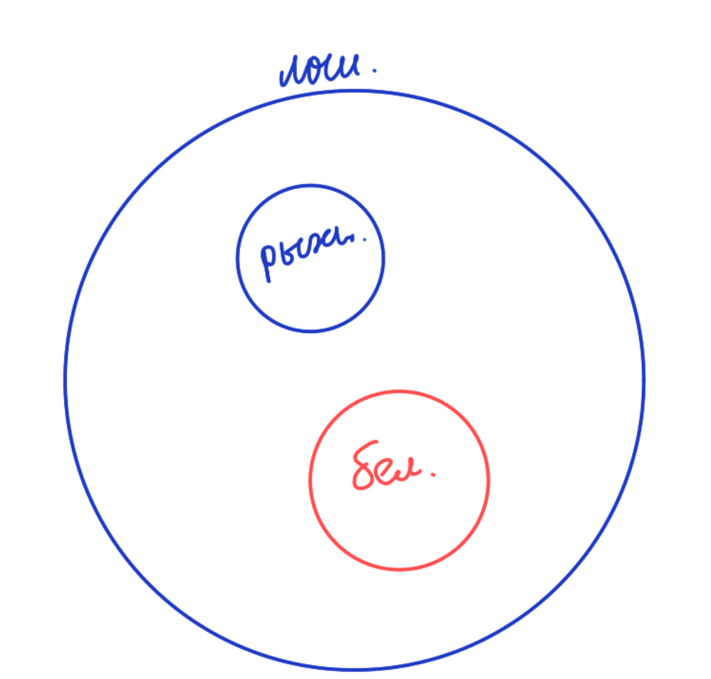
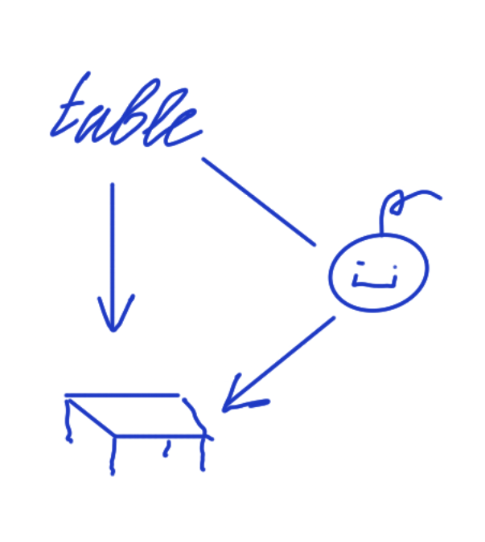

#### Китайский парадокс
создатель: китайский философ Гунсунь лун представитель школы Мин (Конфуцианство)
Человек решил провести через границу белую лошадь, так как он был философом он решил доказать, что белая лошадь не лошадь, использую такую логику:
- Лошади бывают рыжими
- Белая лошадь не может быть рыжей
- -> Следовательно белая лошадь не лошадь (Л)

- Дедуктивный - от общего к частному. В дедуктивных рассуждениях истинность посылок гарантирует истинность рассуждения 
- В вероятностных рассуждениях истинные посылки повышает шанс истинности рассуждений 

Семиотика - учение о знаках. Семенон (с греческого "знак", "симптом").
Одним из определением культуры является семиотика (знаковое)

Ч. -С. Пирс, Ф. де Соссюр - основоположники Семиотики.

Знак (по Пирсу) есть нечто что замещает что-то для кого-то.

Язык - является системой знаков.

Синтаксис, как раздел семиотики - это исследование знаков и их отношений

Семиотическая рамка (кадр, фрейм) - это рамка в которой происходит условная игра знаков (например, герой в романе находится в семиотической рамке)
Семантика - это исследование отношение знака к замещающему 
Связь знака со значением является конвенциональной (условная, договорная основа)
Смысл - это информация об обьекте заключенная в знаки.

Георг IV однажды хотел узнать является ли Вальтер Скот автором Веверлея (этот контекст наглядно показывает, что важно не только значение, но и смысл)

Смысл = интенсионал

Прагматика - это исследование отношение интерпретатора к знаку и значению.
Коннотация - это ассоциации, которые связывают интерпретатора и знак.

Эвфемизация - это иллюзорное улучшение денотата (значения) с помощью коннотации
Дисфемизация - это иллюзорное ухудшение денотата (значения) с помощью коннотации